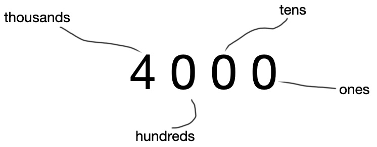
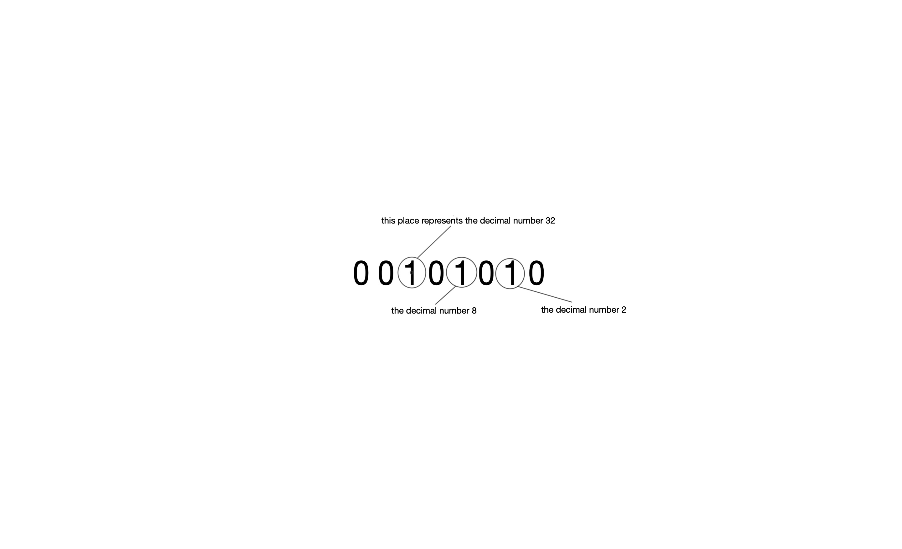
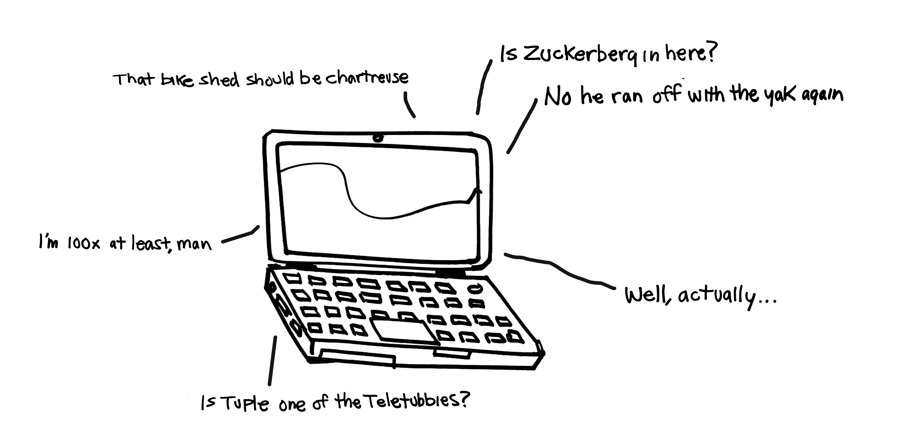
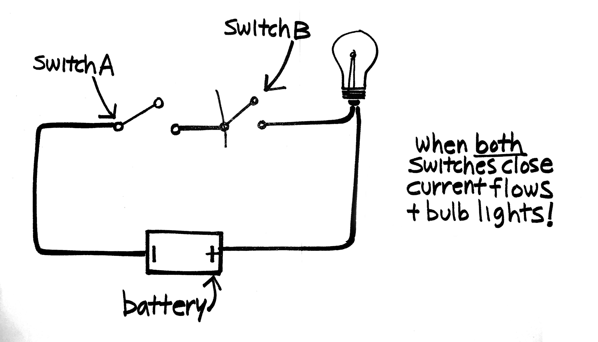
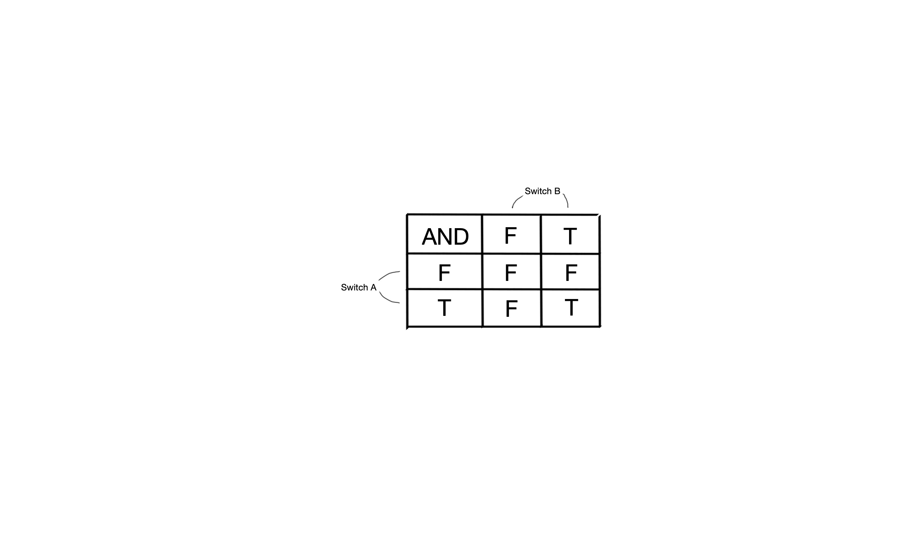
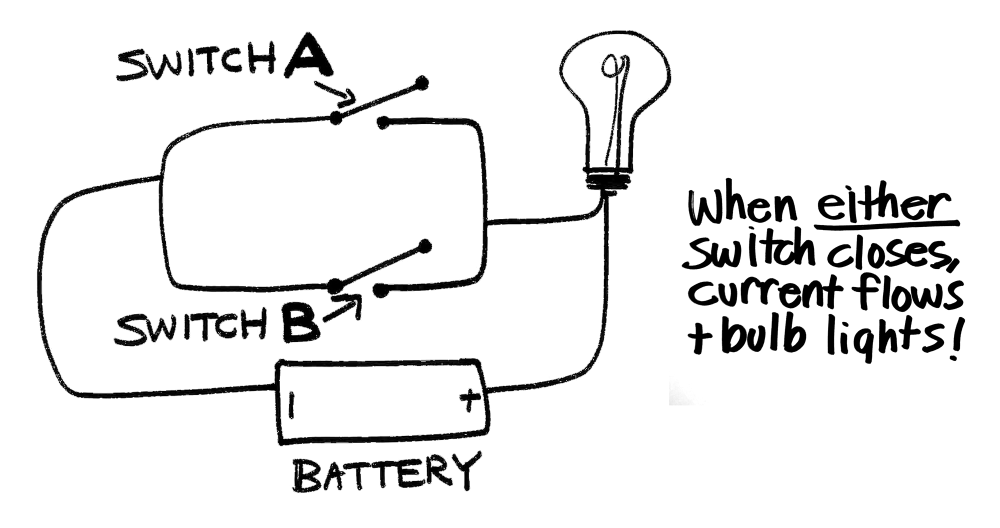
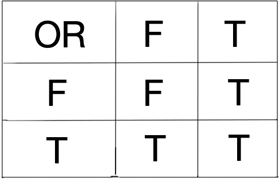
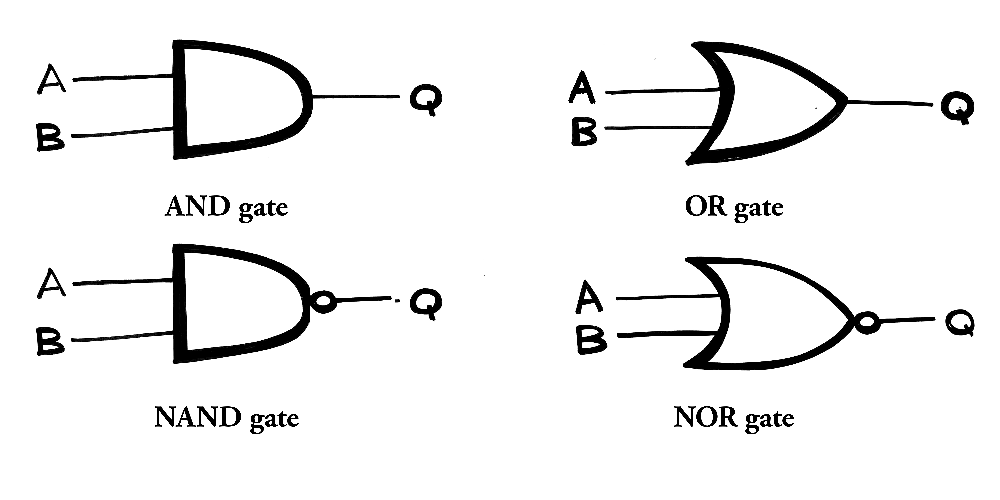

#**Audiobook Cartoons & Code**<br>
##**Chapter 1:** "Revenge of the SpaghettiOs"
###Figure 1
```html
<h1 style="color:yellow; font-family:Helvetica; text-size=60px">
    Do coders dream of numeric sheep?
</h1>
```
<br>
##**Chapter 3:** "PyLadies and Code Freaks"
###Fig. 1
```python
code_slang = [
    "bug",
    "hindenbug",
    "heisenbug",
    "nerdjack",
    "pebkac",
    "non-trivial",
    "fubar",
]
```

###Fig. 2
```python
code_slang_dict = {
    "bug": "a problem in a piece of software",
    "hindenbug": "a catastrophic problem in a piece of software",
    "heisenbug": "a bug that disappears or changes behavior when studied",
    "nerdjack": "to hijack a conversation with excessive nerdy detail",
    "pebkac": "problem exists between keyboard and chair",
    "non-trivial": "a fiendishly difficult problem",
    "fubar": "fucked up beyond all recognition",
}
```

###Fig. 3
```python
def to_celsius(fahrenheit):
    celsius = (fahrenheit - 32) * (5 / 9)
    print(celsius)
```

###the "function call":
```python
to_celsius(77)
```

###our output:
```python
25
```

<br>
##**Chapter 5:** "The Real Moriarty"
###Boolean algebra symbols
(a) ones and zeroes, to indicate *true* and *false* or *everything* and *nothing*;<br>
(b) the basic operators *and*, *or*, *not*;<br>
(c) "variables" to which "values" could be assigned (e.g., x = country singers named "Wayne")

###The Weird Sisters function
Like most symbolic languages, Boolean algebra looks (and pretty much is) intimidating at first, but the specifics of the symbols are not important here: what matters is the logic of how the world gets represented and how these representations can be operated on. Say a trio of witches hope to tempt a future king of Scotland to his doom. No problem. Witches have a potion for that, and a recipe for the potion. But what if even Lidl doesn’t have all the ingredients? We might represent the resulting compromise thus:<br>
<div style="margin-left: 40px;">
if:<br>
x = standard ingredients for the Weird Sisters’ potion;<br>
y = blind worm’s sting;<br>
z = owlet’s wing;<br>
then<br>
x—(y + z) = the potion, minus blind worm’s sting and owlet’s wing<br>
</div>
The Sisters know this compromised potion won’t work, so they try Whole Foods, where they thrill to see blind worm’s sting and owlet’s wing on sale—it’s Black Friday—but find eye of newt and toe of frog too overpriced to stomach. As such, we might reassign the variables like so:<br>
<div style="margin-left: 40px;">
y = eye of newt<br>
z = toe of frog<br>
In which case:<br>
x—(y + z) = the potion, minus eye of newt and toe of frog.<br>
</div>
Happily, this will work. Macbeth is doomed by his own ambition, which the civic-minded witches have merely tweaked, perhaps sparing Scotland a long and brutal Macbeth dynasty. The point is that we were able to reassign the variables without changing the validity of the output: this formula (or function) is universal. Note again that we are interested only in logical truth; whether a statement is empirically true in the external world is of no concern to a logician or a computer.

<br>
##**Chapter 7:** "Theories of Memory"
###Fig. 01

{ width="450" }

###Fig. 10
{ width="450" }

###Fig. 11
{ width="1000" }

###Fig.100
{ width="1000" }

###Fig. 101
the binary number 00101010 (42 decimal) stored by means of Elvis impersonators (*image to come*)

###Fig. 110
{ width="600" }

###Boolean algebra symbols reminder
(a) ones and zeroes, to indicate *true* and *false* or *everything* and *nothing*;<br>
(b) the basic operators *and*, *or*, *not*;<br>
(c) "variables" to which "values" could be assigned (e.g., x = dogs named "Kevin")

###Fig. 111
circuit diagram for an AND gate<br>
{ width="600" }

###Fig.1000
An AND gate truth table. Only if both inputs are positive/true - also understood as a 1 in computing - is a positive/true output produced.<br>
{ width="600" }

###Fig. 1001
circuit diagram for an OR gate<br>
{ width="600"}

###Fig. 1011
An OR gate truth table. If *either* input is positive/true then the output will be positive/true. Only if *both* are negative/false - equating to a zero in computing - will a false/negative output be produced.<br>
{ width="600" }

###Logic Gate Symbols
AND:<br>
{ width="600" }<br>


<br>
##**Chapter 9:** "Catch 32"
###zombies list
```python
zombies = [zombie1, zombie2, zombie3]
```

###animate zombies function
```python
def animate_zombies():
    for zombie in zombies:
        zombie.frame += 1
        if zombie.frame == 5:
            zombie.frame = 1
```

###Apollo 11 'Burn Baby Burn'
==ending—deliriously—with the assembly language source code
for the Apollo 11 lunar module==:
This was posted to GitHub as recently as 2016. Apollo fans
may further enjoy the ABC News piece, "[Apollo 11's Source Code Has Tons
of Easter Eggs, Including an Ignition File Titled 'Burn Baby Burn:
There are jokes, Shakespeare quotes and a reference to the Black Power
movement][burn]."
[burn]:https://abcnews.go.com/Technology/apollo-11s-source-code-tons-easter-eggs-including/story?id=4051522  

Even an untrained eye can recognize the caution baked into
*Burn Baby Burn*, the program designed to ignite the lunar lander rocket
and shoot Armstrong and Aldrin back into space from the surface of the
moon, from the number of Boolean "flags" used to confirm the program's
correct running at critical points. To give a sense of what this looks
like, here's a portion of the Assembly-like code for *Burn Baby Burn*:
```assembly
COMFAIL TC UPFLAG \# (15)

ADRES IDLEFLAG

TC UPFLAG \# SET FLAG TO SUPPRESS CONFLICTING DISPLAY

ADRES FLUNDISP

CAF FOUR \# RESET DVMON

TS DVCNTR

CCS PHASE6 \# CLOCKTASK ACTIVE?

TCF +3 \# YES

TC BANKCALL \# OTHERWISE, START IT UP

CADR STCLOK1

+3 CS VB97DEX

TS DISPDEX

TC PHASCHNG \# TURN OFF GROUP 4.

OCT 00004

TCF ENDOFJOB

COMFAIL1 INDEX WHICH

TCF 2

COMFAIL3 CA Z \# (15) KILL CLOKTASK USING Z

TCF +2

COMFAIL4 CS CNTDNDEX

TS DISPDEX

TC DOWNFLAG \# RECONNECT DV MONITOR

ADRES IDLEFLAG

TC DOWNFLAG \# PERMIT GUIDANCE LOOP DISPLAYS

ADRES FLUNDISP

TCF ENDOFJOB

COMFAIL2 TC PHASCHNG \# KILL ZOOM RESTART PROTECTION

OCT 00003

INHINT

TC KILLTASK \# KILL ZOOM IN CASE IT'S STILL TO COME

CADR ZOOM

TC IBNKCALL \# COMMAND ENGINE OFF

CADR ENGINOF4

TC UPFLAG \# SET THE DRIFT BIT FOR THE DAP.

ADRES DRIFTDFL

\# Page 743

TC INVFLAG \# USE OTHER RCS SYSTEM

ADRES AORBTFLG

TC UPFLAG \# TURN ON ULLAGE

ADRES ULLAGFLG

CAF BIT1

INHINT

TC TWIDDLE

ADRES TIG-5

TCF ENDOFJOB
```

<br>
##**Chapter 11:** "The Gun on the Mantelpiece"
###Shakespearian Insult Engine program
Code looks so much better in its natural habitat, color-coded and onscreen. Here are the three versions of the Shakespearian Insult Engine in this much happier environment, from least to most sophisticated. Anyone fancying a project could translate this into "PyScript", which (like JavaScript) can run in a web browser—a big deal in the coding world. PyScript, incidentally, is the project Nicholas Tollervey now works on at Anaconda. A pleasing symmetry.
###Fig. 1
```python
from random import choice

adjA = [
    "mammering",
    "saucy",
    "beslubbering",
    "spleeny",
    "yeasty",
    "mewling"
]
adjB = [
    "rump-fed",
    "plume-plucked",
    "onioneyed",
    "clay-brained",
    "beetle-headed",
]
noun = [
    "bugbear",
    "flap-dragon",
    "hedgepig",
    "joithead",
    "lewdster",
    "moldwarp",
]
```

###Fig. 2
Insult Engine v1
```python
from random import choice

adjA = [
    "mammering",
    "saucy",
    "beslubbering",
    "spleeny",
    "yeasty",
    "mewling"
]
adjB = [
    "rump-fed",
    "plume-plucked",
    "onioneyed",
    "clay-brained",
    "beetle-headed",
]
noun = [
    "bugbear",
    "flap-dragon",
    "hedgepig",
    "joithead",
    "lewdster",
    "moldwarp",
]

word1 = choice(adjA)
word2 = choice(adjB)
word3 = choice(noun)
insult = f"{word1} {word2} {word3}"
print(insult)
```

###Fig. 3
sample program output 1
```python
=> spleeny plume-plucked flapdragon
=> yeasty beetle-headed bugbear
=> mewling rump-fed moldwarp
```

###Fig. 4
Insult Engine v2 with f-string
```python  
from random import choice

adjA = [
    "mammering",
    "saucy",
    "beslubbering",
    "spleeny",
    "yeasty",
    "mewling"
]
adjB = [
    "rump-fed",
    "plume-plucked",
    "onioneyed",
    "clay-brained",
    "beetle-headed",
]
noun = [
    "bugbear",
    "flap-dragon",
    "hedge-pig",
    "joithead",
    "lewdster",
    "moldwarp",
]

print(f"{choice(adjA)} {choice(adjB)} {choice(noun)}!")
```

###sample output 2
```python
=> mammering clay-brained joithead
=> beslubbering onion-eyed lewdster
=> saucy plume-plucked hedge-pig
```

###Fig. 5
finished Shakespearian Insult Engine program
```python
from random import choice

adjA = [
    "paunchy",
    "reeky",
    "lumpish",
    "rank",
    "goatish",
    "surly"
]
adjB = [
    "tickle-brained",
    "weather-beaten",
    "sheep-biting",
    "swag-bellied"
]
noun = [
    "codpiece",
    "puttock",
    "minnow",
    "maggot-pie",
    "pie-face",
    "varlot"
]


def insult_engine():
    bardish_insult_bank = []
    for i in range(100):
        insult_i = f"{choice(adjA)} {choice(adjB)} {choice(noun)}!"
        if insult_i not in bardish_insult_bank:
            bardish_insult_bank.append(insult_i)
    next_action = input("Generate a Bardish insult? (y/n): ")
    while next_action == "y":
        print(f"\n{bardish_insult_bank.pop(0)}")
        next_action = input("\nPrithy another? (y/n): ")
    else:
        return f"\nFarewell, thou {bardish_insult_bank[0]}\n"


insult_engine()
```

###sample output 3
```python
=> rank swag-bellied codpiece!
=> goatish pickle-brained puttock!
=> reeky sheep-biting pie-face!
```

###sample exit message
```python
=> Farewell, thou paunchy weather-beaten maggot-pie!
```

###full list of Shakespearian insults
Want to have a go at making your own Insult Engine? Download the Mu editor (my suggestion because it's free and so immediate and easy to use, but there are plenty of free alternatives) and run the Insult Engine at your leisure. If you're feeling adventurous, substitute the six-word lists of adjectives and nouns above with the full 40-word lists given below. Props to the British Library for collating these.
```python
adjA = ['mammering', 'saucy', 'beslubbering', 'spleeny', 'yeasty', 'artless', 'bawdy', 'bootless', 'churlish', 'cockered', 'clouted', 'craven', 'currish', 'dankish', 'dissembling', 'droning', 'errant', 'fawning', 'fobbing', 'froward', 'frothy', 'gleeking', 'goatish', 'gorbellied', 'impertinent', 'infectious', 'jarring', 'loggerheaded', 'lumpish', 'mangled', 'mewling', 'paunchy', 'pribbling', 'puking', 'puny', 'qualling', 'rank', 'reeky', 'roguish', 'ruttish', 'spleeny', 'spongy', 'surly', 'tottering', 'unmuzzled', 'vain', 'venomed', 'villainous', 'warped', 'wayward', 'weedy']
adjB = ['rump-fed', 'plume-plucked', 'base-court', 'bat-fouling', 'beef-witted','onion-eyed', 'flap-mouthed', 'beetle-headed', 'boil-brained', 'clapper-clawed', 'clay-brained', 'common-kissing', 'crook-pated', 'dismal-dreaming', 'dizzy-eyed', 'doghearted', 'dread-bolted', 'earth-vexing', 'elf-skinned', 'fat-kidneyed', 'fen-sucked', 'fly-bitten', 'folly-fallen', 'fool-born', 'full-gorged', 'guts-griping', 'half-faced', 'hasty-witted', 'hedge-born', 'hell-hated', 'idle-headed', 'ill-breeding', 'ill-nurtured', 'knotty-pated', 'milk-livered', 'motley-minded', 'pottle-deep', 'pox-marked', 'reeling-ripe', 'rough-hewn', 'rude-growing', 'shard-born', 'sheep-biting', 'spur-galled', 'swag-bellied', 'tardy-gated', 'tickle-brained', 'toad-spotted', 'unchin-snouted', 'weather-bitten']
noun = ['clotpole', 'flap-dragon', 'gudgeon', 'hedge-pig', 'malt-worm', 'apple-john', 'baggage', 'barnacle', 'bladder', 'boar-pig', 'bugbear', 'bum-bailey', 'canker-blossom', 'clack-dish', 'coxcomb', 'codpiece', 'death-token', 'dewberry', 'flaxwench', 'flirt-gill', 'foot-licker', 'fustilarian', 'giglet', 'haggard', 'harpy', 'horn-beast', 'hugger-mugger', 'joithead', 'lewdster', 'lout', 'maggot-pie', 'mammet', 'measle', 'minnow', 'miscreant', 'moldwarp', 'mumble-news', 'nut-hook', 'pigeon-egg', 'pignut', 'puttock', 'pumpion', 'ratsbane', 'scut', 'skainsmate', 'strumpet', 'varlot', 'vassal', 'whey-face', 'wagtail']
```

###Fig. 6
an empty list for potato salad ingredients
```python
pot_salad_bits = []
```

<br>
##**Chapter 15:** "A Codemy of Errors"
###Fig.1
Sonic Pi Blue Monday bass intro code
```ruby
8.times do
    play 38
    sleep 0.5
end
play 38
sleep 1
play 36
sleep 1
play 38
sleep 2
```

###Fig.2
Sonic Pi zip function
```ruby
define :playseq do |notes, durations|
notes.zip(durations).each do |n,d|
play n
sleep d
end
end
```

###Fig. 3
zipped Peter Hook bassline
```ruby
hookybass_notes = [38,38,38,38,38,38,38,38,38,36,3 2 8,41,41,41,41,41,41,41,41,41,43,38]
hookybass_durs = [0.5,0.5,0.5,0.5,0.5,0.5,0.5,0.5,1, 4 1,2,0.5,0.5,0.5,0.5,0.5,0.5,0.5,0.5,1,1,2]
2.times do
use_synth hooky_bass
with_fx :reverb, pre_mix: 0.8, mix: 0.6, room: 1 do
playseq(hookybass_notes, hookybass_durs)
end
end
```

###Supercollider error message
```c
ERROR: There is a discrepancy.
numClassDeps 1116 gNumClasses 2230
```

###FoxDot quark error
```c
"/Users/andrewsmith/Library/Application Support/SuperCollider/
downloaded-quarks/FoxDotQuark/FoxDot.sc"
"/Users/andrewsmith/Library/Application Support/
SuperCollider/downloaded-quarks/FoxDot/FoxDot.sc"
```

<br>
##**Chapter 17:** "Apologies to Richard Feynman"
###Jsonerator function def
```python
def google_sheet_faq_data():
```
###with type annotation (ugh!)
```python
def google_sheet_faq_data(sheet: str, gid: str) -> Iterable[List[str]]:
```